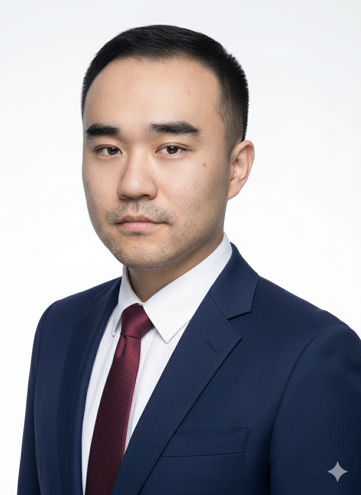

# Wei Lin

MBA Student · Digital Transformation · Data & AI  

Looking for opportunities in **data-driven marketing** and **digital transformation**.

I am an MBA student at **University Canada West**.  
I am interested in digital transformation, data analytics, and using AI tools to support business decisions.

[View CV / Resume](resume.qmd){.btn .btn-primary .me-2}
[View MBA Projects](projects.qmd){.btn .btn-outline-secondary}

{.img-fluid .rounded-circle .shadow style="max-width:260px;"}

## Quick Highlights

- Background in **Chemical Engineering** and **MBA** training in Canada.
- Experience as **Dispatcher** at Hengshen Group (Shenyuan Company), coordinating daily production and logistics.
- Built **finance and marketing case studies** during the MBA (for example, financial models, market analysis, and AI-in-business projects).
- Multilingual: **Mandarin**, **English**, **French (basic)**, **Japanese (basic)**.

## What you can find on this site

- **Home** – quick overview of who I am and my focus areas.
- **Resume** – my education, work experience, and key skills on one page.
- **Projects** – selected MBA projects and case studies with short descriptions.
- **About** – my story, career goals, and what I am learning now.
- **Contact** – email and LinkedIn links for work, networking, or collaboration.

---

© 2025 Wei Lin · Built with Quarto

